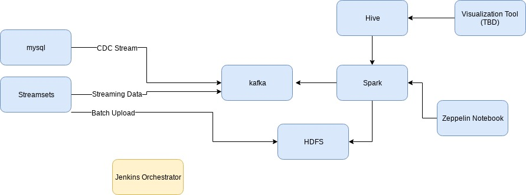

kalitical is a pet project aimed at providing an out-of-the-box advanced analytical environment - on premises and on cloud

Reasons to do this:
	Kubernetes is platform agnostic - i.e. cloud provider or on premises agnostic - making it an ideal target platform
	Big data platforms are rife with underutilizing resources - trying to consolidate resources will help with cost
	Automating this will provide a lower bar of entry to trying advanced analytics
	Developers will be able to experiment with the entire stack on their local machine

